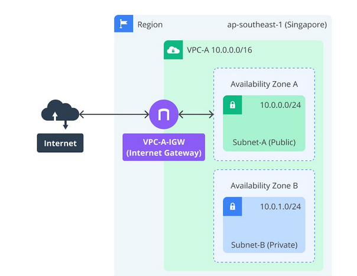

# Final Task Proyek Membangun Web Server  
**Pada hasil pembelajaran kali ini, saya membuat proyek membangun web server menggunakan server aws dan nginx sebagai web servernya serta menerapkan access limit dan dns.** 
**Berikut ini adalah contoh skema dari server yang telah saya buat.** 
 
